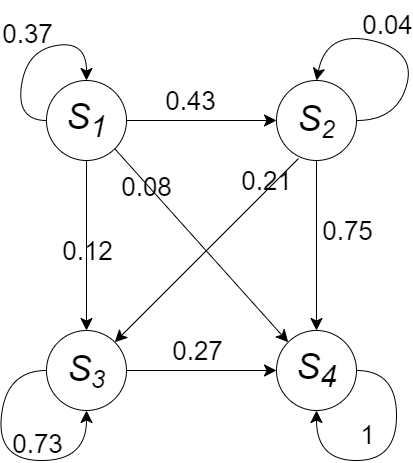

Кузнецов Григорий ИУ5-83Б

# Задание 1

В процессе эксплуатации ЭВМ осуществляются ее разовые проверки, в
результате которых она может оказаться в следующих состояниях:

-   $S_1$ - ЭВМ полностью исправна;

-   $S_2$ - ЭВМ имеет незначителльные неисправности в программном
    обеспечении, при которых она может решать задачи;

-   $S_3$ - ЭВМ имеет существенные неисправности и может решать
    ограниченный класс задач;

-   $S_4$ - ЭВМ полностью вышла из строя.

В начальный момент времени ЭВМ полностью исправна (состояние $S_1$).
Проверка ЭВМ производится в фиксированные моменты времени $t_k$.
Процесс, протекающий в системе, может рассматриваться как однородная
марковская цепь с $k$ шагами ($1, 2,\ldots, k$ проверки). Матрица
переходных вероятностей имеет вид: \begin{equation}
P = \begin{pmatrix} p_{11} & p_{12} & p_{13} & p_{14} \\ 0 & p_{22} & p_{23} & p_{24} \\0 & 0 & p_{33} & p_{34}\\ 0 & 0 & 0 & p_{44}\end{pmatrix} 
\end{equation}

Построить граф состояний. Найти вероятности (численно и теоретически)
состояний ЭВМ после $k-2$, $k-1$, $k$ осмотров.

## Теория

Граф состояний:



Обозначим через $p(0) = (p_1(0),p_2(0),…,p_n(0))$ - вектор вероятностей
нахождения в каждом из $n$ состояний в начальный момент времени $t=0$.

Тогда

$$
p(1) = p(0) \cdot P
$$ $$
p(2) = p(1)\cdot P = p(0) \cdot P^2
$$ $$
...
$$ $$
p(k) = p(0) \cdot P^k
$$ Данные варианта:

```{r}
Variant<-12
set.seed(Variant) 
k<-sample(c(4:9),1)
pp1<-runif(4)
pp2<-runif(3)
pp3<-runif(2)
p1<-pp1/sum(pp1)
p2<-c(c(0),pp2/sum(pp2))
p3<-c(c(0,0),pp3/sum(pp3))
p4<-c(0,0,0,1)
P<-data.frame()
P<-rbind(P,p1)
P<-rbind(P,p2)
P<-rbind(P,p3)
P<-rbind(P,p4)
rownames(P)<-c("p1","p2","p3","p4")
colnames(P)<-c("","","","")
P
print(paste("k=",as.character(k)))
```

Рассчитаем теоретический результат:

```{r}
#install.packages("matrixcalc")
library(matrixcalc)
resultTheory <- data.frame(p1 = c(0,0,0), p2 = c(0,0,0), p3 = c(0,0,0), p4 = c(0,0,0))

mat <- as.matrix(P)
resultTheory[1, ] <- c(1, 0, 0, 0) %*% matrix.power(mat, k - 2)
resultTheory[2, ] <- c(1, 0, 0, 0) %*% matrix.power(mat, k - 1)
resultTheory[3, ] <- c(1, 0, 0, 0) %*% matrix.power(mat, k)
rownames(resultTheory) <- c("k - 2", "k - 1", "k")

resultTheory
```

## Эксперимент

Расчитаем экспериментальный результат:

```{r}
getNextState <- function(pVector) {
  r <- runif(1)
  sum <- 0
  for (i in 1:length(pVector)) {
    sum <- sum + pVector[i]
    if (r <= sum) return(i)
  }
}

resultExperiment <- data.frame(p1 = c(0, 0, 0), p2 = c(0, 0, 0), p3 = c(0, 0, 0), p4 = c(0, 0, 0))
n <- 1000
for (i in 1:n) {
  state <- 1
  for (j in 1:k) {
    state <- getNextState(P[state, ])
    if (j == k - 2) resultExperiment[1, state] <- resultExperiment[1, state] + 1
    else if (j == k - 1) resultExperiment[2, state] <- resultExperiment[2, state] + 1
    else if (j == k) resultExperiment[3, state] <- resultExperiment[3, state] + 1
  }
}

resultExperiment <- resultExperiment / n
rownames(resultExperiment) <- c("k - 2", "k - 1", "k")

resultExperiment
```

Значения совпадают

# Задание 2

Вычислительный центр фирмы состоит из одного главного сервера
коллективного пользования. Число работающих в в центре программистов в
любой момент времени равно $k$. Каждый программист готовит свою
программу и через терминал передает ее на сервер для выполнения, куда
она сразу попадает. Время подготовки программ имеет экспоненциальное
распределение со средним значением $t_1$ мин. Время выполнения программы
имеет экспоненциальное распределение со средним значением $t_2$ мин.
Найти (теоретически и экспериментально):

-   вероятность того, что программа не будет выполнена сразу же, как
    только она поступила на терминал;

-   среднее время до получения пользователем результатов реализации;

-   среднее количество программ, ожидающих выполнения на сервере.

## Теория

Задача представляет собой одноканальную СМО с неограниченной очередью
при $\lambda=\frac{k}{t_1}$ и $\mu=t_2$.

Обозначим $\rho=\frac{\lambda}{\mu}$, тогда, согласно лекции 3,
вероятность того что сервер будет свободен (при $t\to\infty$): 
$$
P_0 = (1 + \rho + \rho^2 + ... + \rho^k + ..)^{-1} = 1 - \rho
$$

Следовательно, **вероятность того, что программа не будет выполнена
сразу же, как только она поступила на терминал**, т.е. вероятность того
что терминал занят: 
$$
P_{Busy} = 1 - P_0 = \rho
$$
**среднее время до получения пользователем результатов реализации** - среднее время пребывания заявки в системе. Из лекции 3:
$$
T_{сист} = \frac{1}{\mu(1-p)}
$$
**среднее количество программ, ожидающих выполнения на сервере** - средняя длина очереди. Из лекции 3:
$$
L_{оч} = \frac{\rho^2}{(1-p)}
$$
Данные варианта:
```{r}
Variant<-12
set.seed(Variant) 
k<-sample(c(10:25),1)
t1<-sample(c(14:20),1)
t2<-sample(c(2:5),1)

# k = 2, иначе a > u, задача неразрешима
k <- 2
a1 <- t1^-1
a2 <- t2^-1

p <- k * a1 / a2
```

Рассчитаем теоретический результат:
```{r}
results <- data.frame(theory = numeric(3))
rownames(results) <- c("Вероятность что программа не будет выполнена сразу",
                       "Среднее время ожидания до реализации",
                       "Среднее количество программ ожидающих реализации")
results[, 1] = c(p, 1/(a2*(1-p)), p^2/(1-p))
results
```
## Эксперимент

Расчитаем экспериментальный результат:

Представим модель в виде последовательности собитий: программист подготовил программу или сервер завершил обработку программы. 
Будем хранить последовательность времен этих событий.

```{r}
events <- matrix(nrow = 3)
events <- events[, -1]
N <- 100000
currentTime <- 0
queue <- c()
serverBusy <- FALSE
programmersWaiting <- sample(c(FALSE), k, replace = TRUE)

queueStat <- c()
JITAddStat <- c()
waitTime <- c()

createEvent <- function(events, currentTime, rate, index, programTime) {
  time <- rexp(1, rate)
  events <- cbind(events, c(index, currentTime + time, programTime))
  return(events)
} 

for (i in 1:N) {
  for (j in 1:length(programmersWaiting)) {
    if (!programmersWaiting[j]) {
      events <- createEvent(events, currentTime, a1, j, currentTime)
      programmersWaiting[j] <- TRUE
    }
  }
  events <- events[,order(events[2, ])]
  
  event <- events[,1]
  events <- events[,-1]
  currentTime <- event[2]
  
  if (event[1] == 0) {
    if (length(queue) == 0)
      serverBusy <- FALSE 
    else {
      programTime <- queue[1]
      queue <- queue[-c(1)]
      events <- createEvent(events, currentTime, a2, 0, programTime)
    }
    waitTime <- rbind(waitTime, currentTime - event[3])
    queueStat <- c(queueStat, length(queue))
  } else {
    programmersWaiting[event[1]] <- FALSE
    if (serverBusy) {
      queue <- c(queue, currentTime)
      JITAddStat <- c(JITAddStat, 1)
    }
    else {
      serverBusy <- TRUE
      events <- createEvent(events, currentTime, a2, 0, currentTime)
      JITAddStat <- c(JITAddStat, 0)
    }
  }
}

results[1, 2] = mean(JITAddStat)
results[2, 2] = mean(waitTime)
results[3, 2] = mean(queueStat)

colnames(results) <- c("theory", "experiment")
results
```

Значения совпадают
