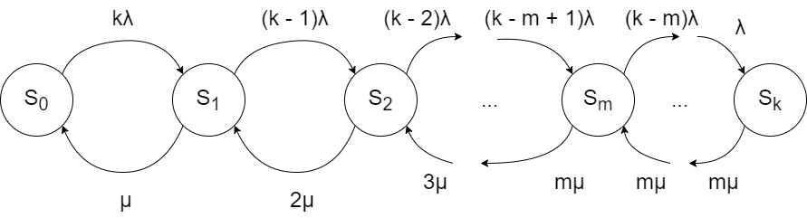

Кузнецов Григорий ИУ5-83Б

# Задание

Вычислительный центр фирмы состоит из $m$ главных серверов коллективного пользования. Число работающих в в центре программистов в любой момент времени равно $k$. Каждый программист готовит свою программу и через терминал передает ее на сервер для выполнения, куда она сразу попадает. Время подготовки программ имеет экспоненциальное распределение со средним значением $t_1$ мин. Время выполнения программы на любом из серверов имеет экспоненциальное распределение со средним значением $t_2$ мин. Каждый программист ожидает ответа от сервера, прежде, чем начнет писать следующую программу.

Найти (теоретически и экспериментально):

- вероятность того, что программа не будет выполнена сразу же, как только она поступила на терминал;

- среднее время до получения пользователем результатов реализации;

- среднее количество программ, ожидающих выполнения на сервере.

Требуется выполнить расчет при заданном по варианту значении $m$, а также при $m=1$.

# Теория

Система будет иметь следующие состояния:

-   $S_0$ - все серверы свободны, очередь пуста
-   $S_i, \; где \; 1 \le i \le \min(m, k)$ - занято $i$ серверов, очередь пуста
-   $S_i, \; где \; min(m, k) < i \le k$ - заняты все $m$ серверов, в очереди $i - m$ программ



Используя правила Колмогорова можем раcчитать вероятности нахождения системы в каждом состоянии (при $t\to\infty$)

$$
P_1 = \frac{k\cdot\lambda}{\mu}P_0 = kyP_0\\
P_2 = \frac{(k-1) \lambda}{2\mu}P_1 = y\frac{k-1}{2}P_1 \\
P_i = y\frac{k-i+1}{i}P_{i-1},\quad где\space 1\leq i\leq m
$$

$P_i$ является реккурентной последовательностью первого порядка c переменными коэффициентами, [имеет решение](https://en.wikipedia.org/wiki/Recurrence_relation#Solving_first-order_non-homogeneous_recurrence_relations_with_variable_coefficients):
$$
P_i = \left(\prod_{s=1}^{i}y\frac{k-s+1}{s}\right)P_0 = y^i\cdot \frac{1}{i!}\cdot k(k-1)(k-2)...(k-i+1)\cdot P_0= y^i\binom{k}{i}P_0,\quad 1 \leq i \leq m\\
P_m = y^m\binom{k}{m}P_0\\
P_{m+1} = \frac{(k-m)\lambda}{m\mu}P_m = \frac{(k-m)}{m}yP_m\\
P_i = \prod_{s=0}^{i-m-1}\left(\frac{(k-m-s)y}{m}\right)P_m,\quad m < i \leq k \\
P_i = \left\{
    \begin{array}{lr}
        y^i\binom{k}{i}P_0, &  1 \leq i \leq m\\
        \frac{(k-m)!}{(k-i)!m^{i-m}}y^i\binom{k}{m}P_0, &  m < i \leq k
    \end{array}\right.
$$

По нормировочному уравнению получаем:
$$
\sum_{i=0}^{k}P_i = 1 \implies P_0 + \sum_{i=1}^kP_i=1\\ P_0 = \left(1+\sum_{i=1}^{m}y^i\binom{k}{i}+\sum_{i=m+1}^{k}\frac{(k-m)!}{(k-i)!m^{i-m}}y^i\binom{k}{i} \right)^{-1}
$$

Получаем что:

- **вероятность, что программа не будет выполнена сразу**:
$$
P_{Busy} = \sum_{i=m}^kP_i
$$

- **среднее время до получения пользователем результатов реализации**:

Среднее число программ на обслуживании:
$$
L_{об} = \sum_{i=0}^{m-1}P_i \cdot i + m \cdot \sum_{i=m}^{k}P_i 
$$
Абсолютная пробускная способность:
$$
\Lambda = \frac{L_{об}}{t_2} = L_{об}\cdot\mu
$$
Среднее число программ в системе:
$$
L_{сист} = \sum_{i=1}^kP_i \cdot i
$$

Среднее время программы в системе - среднее время до получения пользователем результатов реализации:
$$
L_{сист} = \Lambda \cdot T_{сист} \implies T_{сист} = \frac{L_{сист}}{\Lambda}\\
T_{сист} = \frac{\sum_{i=1}^kP_i \cdot i}{\Lambda} = \frac{\sum_{i=1}^kP_i \cdot i}{\left(\sum_{i=0}^{m-1}P_i \cdot i + m \cdot \sum_{i=m}^{k}P_i \right)\mu}
$$

- **среднее количество программ, ожидающих выполнения на сервере** - средняя длина очереди:
$$
L_{оч} = \sum_{i=m+1}^k (i - m) P_i
$$

## Данные варианта
```{r}
Variant<-12
set.seed(Variant) 
k<-sample(c(10:25),1)
m<-sample(c(3:6),1)
t1<-sample(c(14:20),1)
t2<-sample(c(2:5),1)
data.frame(k,m,t1,t2)
```
## Расчет теоретических значений

```{r}
a <- t1^-1
mu <- t2^-1
y <- a / mu

getPCoef <- function(i, k, m) {
  if (i <= m)
    return(y^i * choose(k,i))
  else
    return(y^i * choose(k,m) * factorial(k-m) / (factorial(k-i)*m^(i-m)))
}

getTheoreticalValues <- function(m) {
  
  P_0 <- 0
  for (i in 1:k) {
    P_0 <- P_0 + getPCoef(i, k, m)
  }
  P_0 <- (1 + P_0)^-1
  
  P_Busy <- 0
  for (i in m:k) {
    P_Busy <- P_Busy + getPCoef(i, k, m) * P_0
  }
  
  A <- 0
  for (i in 1:k) {
    if (i < m) A <- A + i * getPCoef(i, k, m) * P_0
    else A <- A + m * getPCoef(i, k, m) * P_0
  }
  A <- A * mu
  
  T_sist <- 0
  for (i in 1:k) {
    T_sist <- T_sist + i * getPCoef(i, k, m) * P_0
  }
  T_sist <- T_sist / A
  
  L_q <- 0
  for (i in (m+1):k) {
    L_q <- L_q + (i - m) * getPCoef(i, k, m) * P_0
  }
  
  return(c(P_Busy, T_sist, L_q))
}

results <- data.frame(matrix(nrow = 3, ncol = 4))
colnames(results) <- c("теория m != 1", "эксперимент m != 1", "теория m = 1", "эксперимент m = 1")
rownames(results) <- c("вероятность, что программа не будет выполнена сразу",
                    "среднее время до получения пользователем результатов реализации",
                    "среднее количество программ, ожидающих выполнения на сервере")

results[, 1] <- getTheoreticalValues(m)
results[, 3] <- getTheoreticalValues(1)
results
```

# Экспериментальная проверка

```{r}
getExperimentalValues <- function(m) {

  events <- matrix(nrow = 4, ncol = 0)
  N <- 10000
  currentTime <- 0
  queue <- matrix(nrow = 2, ncol = 0)
  serversBusy <- 0
  programmersWaiting <- sample(c(FALSE), k, replace = TRUE)
  
  queueStat <- c()
  JITAddStat <- c()
  waitTime <- c()
  
  createEvent <- function(events, currentTime, rate, index, programTime, programmerIndex) {
    time <- rexp(1, rate)
    events <- cbind(events, c(index, currentTime + time, programTime, programmerIndex))
    return(events)
  } 
  
  for (i in 1:N) {
    for (j in 1:length(programmersWaiting)) {
      if (!programmersWaiting[j]) {
        events <- createEvent(events, currentTime, a, j, currentTime, j)
        programmersWaiting[j] <- TRUE
      }
    }
    events <- matrix(events[,order(events[2, ])], nrow = 4, ncol = ncol(events))
    
    event <- events[,1]
    events <- matrix(events[,-1], nrow = 4, ncol = ncol(events) - 1)
    currentTime <- event[2]
    
    if (event[1] == 0) {
      if (isTRUE(ncol(queue) == 0))
        serversBusy <- serversBusy - 1
      else {
        program <- queue[,1]
        queue <- matrix(queue[,-1], nrow = 2, ncol = ncol(queue) - 1)
        events <- createEvent(events, currentTime, mu, 0, program[1], program[2])
      }
      programmersWaiting[event[4]] <- FALSE
      queueStat <- c(queueStat, ncol(queue))
      waitTime <- c(waitTime, currentTime - event[3])
    } else {
      if (serversBusy == m) {
        queue <- cbind(queue, c(currentTime, event[1]))
        JITAddStat <- c(JITAddStat, 1)
      }
      else {
        serversBusy <- serversBusy + 1
        events <- createEvent(events, currentTime, mu, 0, currentTime, event[1])
        JITAddStat <- c(JITAddStat, 0)
      }
      queueStat <- c(queueStat, ncol(queue))
    }
  }
  
  return(c(mean(JITAddStat), mean(waitTime), mean(queueStat)))
}

results[, 2] <- getExperimentalValues(m)
results[, 4] <- getExperimentalValues(1)
results
```

