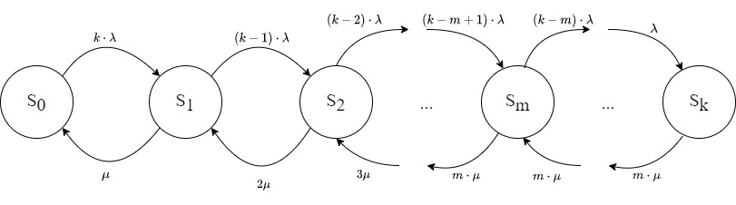

```{r setup, include=FALSE}
knitr::opts_chunk$set(echo = TRUE)
```

# Лабораторная работа 4

Вариант 12

## Импорт библиотек

```{r}
library(matrixcalc)
library(foreach)
```

## Выберем число экспериментов

```{r}
N <- 100000
```

## Задаём вариант

```{r}
Variant<-12
```

## Задание 1

Вычислительный центр фирмы состоит из $m$ главных серверов коллективного пользования. Число работающих в в центре программистов в любой момент времени равно $k$. Каждый программист готовит свою программу и через терминал передает ее на сервер для выполнения, куда она сразу попадает. Время подготовки программ имеет экспоненциальное распределение со средним значением $t_1$ мин. Время выполнения программы на любом из серверов имеет экспоненциальное распределение со средним значением $t_2$ мин. Каждый программист ожидает ответа от сервера, прежде, чем начнет писать следующую программу.

Найти (теоретически и экспериментально):

-   вероятность того, что программа не будет выполнена сразу же, как только она поступила на терминал;
-   среднее время до получения пользователем результатов реализации;
-   среднее количество программ, ожидающих выполнения на сервере.

Требуется выполнить расчет при заданном по варианту значении $m$, а также при $m=1$.

```{r}
set.seed(Variant) 
k<-sample(c(10:25),1)
m<-sample(c(3:6),1)
t1<-sample(c(14:20),1)
t2<-sample(c(2:5),1)
a = 1/t1
mu = 1/t2
View(data.frame(k,m,t1,t2))
```

### Теоретические расчёты

Данная система будет состоясть из $k+1$ состояние, т.к. программисты ожидют выполнения своей задачи:

-   $S_0$ - все серверы свободны, очередь пуста
-   $S_i, \; где \; 1 \le i \le \min(m, k)$ - занято $i$ серверов, очередь пуста
-   $S_i, \; где \; min(m, k) < i \le k$ - заняты все $m$ серверов, в очереди $i - m$ программ



$$
P_1 = P_0 \cdot \frac{k\cdot \lambda}{\mu} = k \cdot y \cdot P_0 \\
P_2 = P_1 \cdot \frac{(k-1)\cdot \lambda}{2\mu} = k \cdot y \cdot \frac{(k-1)\cdot \lambda}{2\mu} \cdot P_0 = \frac{(k-1)\cdot k}{2} \cdot y^2 \cdot P_0 = \frac{k!}{(k-2)! \cdot 2!} \cdot y^2 \cdot P_0 = \binom{2}{k} \cdot y^2 \cdot P_0 \\
... \\
P_m = \binom{m}{k} \cdot y^m \cdot P_0 \\
P_{m+1} = \frac{(k-m) \cdot \lambda}{m \mu} \cdot P_m = \frac{(k-m) \cdot \lambda}{m \mu} \cdot \binom{m}{k} \cdot y^m \cdot P_0= \frac{(k-m)}{m} \cdot \binom{m}{k} \cdot y^{m+1} \cdot P_0 \\
P_{k} = \binom{m}{k} \cdot \frac{ (\prod_{i=0}^{k-m - 1}(k - m - i))\cdot y^{k}}{m^{k-m}} \cdot P_0 
$$

Тогда коэффицент для $P_j$ можно записать как:

```{r}
get_P <- function(j, m, k) {
  if (j <= m) {
    return(choose(k,j) * a^j / mu^j);
  } 
  return(choose(k,m) * prod(c((k-m):(k-j+1))) * a^(j) / mu^(j) / m ^(j-m))
} 
```

Тогда $P_0$ имеет вид:

$$
P_0 = (1+\binom{1}{k} \cdot y\^1 + \binom{2}{k} \cdot y\^2 + .. \binom{m}{k} \cdot y\^m + \binom{m}{k} \cdot \frac{(k - m)}{m} \cdot y\^{m+1} + .. + \binom{m}{k} \cdot \frac{ (\prod_{i=0}^{k-m - 1}(k - m - i))\cdot y^{k}    }{m^{k-m}})\^{-1} = \\ = (\sum*{i=0}\^{m}(*\binom{i}{k} \cdot y\^i) + \binom{m}{k} \cdot y\^m \cdot (\sum{j=m+1}\^{k}(\prod\_{i=0}\^{j-m - 1}(k - m - i))\cdot (\frac{y}{m})^{j-m}))^-1
$$

Посчитаем $P_0$:

```{r}
P_0 <- 0
for (j in c(0:k)) {
  P_0 <- P_0 + get_P(j, m, k)
}

P_0 <- 1 / P_0
```

Среднее число программ в системе оценивается:

$$
L_{сист} = \sum_{j=1}^kP_j \cdot j = \sum_{j=1}^mP_j \cdot j + \sum_{j=m+1}^kP_j \cdot j = (\sum_{j=0}^{m}j\cdot\binom{j}{k} \cdot y^j) \cdot P_0 + \binom{m}{k} \cdot y^m \cdot P_0 \cdot (\sum_{j=m+1}^{k}j\cdot (\frac{y}{m})^{j-m} \cdot(\prod_{i=0}^{j-m - 1}(k - m - i)))
$$

Посчитаем $L_{сист}$:

```{r}
L_sys <- 0
for (j in c(0:k)) {
  L_sys <- L_sys + j * get_P(j, m, k)
}
L_sys <- L_sys * P_0
```

Среднее длина очереди:

$$
L_{оч} = \sum_{i=1}^{k-m}i \cdot P_{m+i} = \sum_{i=m+1}^{k}(i-m) \cdot P_{m+i} = \sum_{i=m+1}^{k}(i-m) \cdot \binom{m}{k} \cdot y^m \cdot P_0 \cdot (\prod_{j=0}^{j-m - 1}(k - m - i)\cdot (\frac{y}{m})^{i-m}) = \binom{m}{k} \cdot y^m \cdot  P_0 \cdot \sum_{i=m+1}^{k}(i-m) \cdot (\frac{y}{m})^{i-m} \cdot \prod_{j=0}^{j-m - 1}(k - m - i)
$$

Посчитаем $L_{оч}$:

```{r}
L_q <- 0
for (j in c((m+1):k)) {
  L_q <- L_q + (j-m) * get_P(j, m, k)
}
L_q <- L_q * P_0
```

Среднее число занятых каналов или среднее число программ на обслуживании:

$$
L_{об} = \sum_{j=0}^{m-1}P_j \cdot j + m \cdot \sum_{j=m}^{k}P_j = \sum_{j=0}^{m}P_j \cdot j + m \cdot \sum_{j=m+1}^{k}P_j = (\sum_{j=0}^{m}j\cdot\binom{j}{k} \cdot y^j) \cdot P_0 + m \cdot \binom{m}{k} \cdot y^m \cdot  P_0 \cdot \sum_{i=1}^{k-m} (\frac{y}{m})^{i-m} \cdot \prod_{j=0}^{j-m - 1}(k - m - i)
$$

Посчитаем $L_{об}$:

```{r}
L_op <- 0
for (j in c(0:m)) {
  L_op <- L_op + j * get_P(j, m, k)
}

for (j in c((m+1):k)) {
  L_op <- L_op + m * get_P(j, m, k)
}

L_op <- L_op * P_0
```

Абсолютная пропускная спосоность:

$$
\lambda' = L_{об} \cdot \mu
$$

Посчитаем $\lambda'$:

```{r}
A <- L_op * mu
```

Среднее время программы в очереди:

$$
L_{оч} = \lambda' \cdot W_{оч} \to W_{оч} = \frac{L_{оч}}{\lambda'}
$$

Посчитаем $W_{оч}$:

```{r}
W <- L_q / A
```

Среднее время программы в системе:

$$
L_{сист} = \lambda' \cdot T_{сист} \to T_{сист} = \frac{L_{сист}}{\lambda'}
$$

Посчитаем $T_{сист}$:

```{r}
T <- L_sys / A
```

Вероятность того, что программа не будет выполнена сразу же, как только она поступила на терминал представляет собой сумму:

$$
P_{busy} = \sum_{i=m}^kP_i = \binom{m}{k} \cdot y^m \cdot P_0 + \binom{m}{k} \cdot y^m \cdot P_0 \cdot (\sum_{j=m+1}^{k}j\cdot (\frac{y}{m})^{j-m} \cdot(\prod_{i=0}^{j-m - 1}(k - m - i))
$$

Посчитаем $P_{busy}$:

```{r}
P_busy <- 0
for (j in c(m:k)) {
  P_busy <- P_busy + get_P(j, m, k)
}

P_busy <- P_busy * P_0
```

*Повторим расчёты для* $m=1$

Посчитаем $P_0$:

```{r}
P_0_m_1 <- 0
for (j in c(0:k)) {
  P_0_m_1 <- P_0_m_1 + get_P(j, 1, k)
}

P_0_m_1 <- 1 / P_0_m_1
```

Посчитаем $P_{busy}$:

```{r}
P_busy_m_1 <- 0
for (j in c(m:k)) {
  P_busy_m_1 <- P_busy_m_1 + get_P(j, 1, k)
}

P_busy_m_1 <- P_busy_m_1 * P_0_m_1
```

Посчитаем $L_{сист}$:

```{r}
L_sys_m_1 <- 0
for (j in c(0:k)) {
  L_sys_m_1 <- L_sys_m_1 + j * get_P(j, 1, k)
}
L_sys_m_1 <- L_sys_m_1 * P_0
```

Посчитаем $L_{об}$:

```{r}
L_op_m_1 <- 0
for (j in c(0:1)) {
  L_op_m_1 <- L_op_m_1 + j * get_P(j, 1, k)
}

for (j in c(2:k)) {
  L_op_m_1 <- L_op_m_1 + m * get_P(j, 1, k)
}

L_op_m_1 <- L_op_m_1 * P_0
```

Посчитаем $\lambda'$:

```{r}
A_m_1 <- L_op_m_1 * mu
```

Посчитаем $T_{сист}$:

```{r}
T <- L_sys_m_1 / A_m_1
```

```{r}

library(queueing)

inp<-NewInput.MMCKK(lambda=a, mu=mu, c=1, k=k)

CheckInput(inp)
o<-QueueingModel(inp)

summary(o)
```
