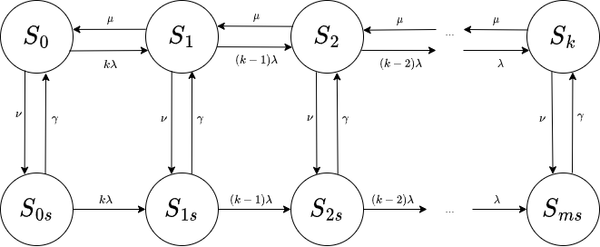

Кузнецов Григорий ИУ5-83Б

Вариант 12

# Задание

Для одноканальной системы массового обслуживания с ограничением на длину очереди $m$ составьте дифференциальные уравнения для вероятностей нахождения в заданных состояниях в зависимости от времени $t$. Найдите эти вероятности при определенном в соответствии с вариантом значении $t$, а также при $t\to\infty$. Канал иногда может выходить из строя. Заявка, которая обслуживается в момент отказа канала ставится в очередь, если там есть места, в противном случае она покидает систему необслуженной. Входящий поток, поток обслуживания, поток отказов и поток восстановления простейшие с соответствующими интенсивностями 
$\lambda, \mu, \nu, \gamma$. Количество клиентов, от которых могут поступать заявки на обслуживание $k$. Начальные условия $P_0(0) = 1$.

Найти (теоретически и экспериментально):

- вероятность простоя;
- вероятность образования очереди;
- абсолютную пропускную способность;
- среднюю длину очереди;
- среднее время нахождения заявок в системе;
- среднее число заявок в системе.
- среднее время нахождения в очереди.

# Решение

Определим состояния системы:

-   $S_0$ - канал свободен, очередь пуста, канал без отказов;
-   $S_1$ - канал занят, очередь пуста, канал без отказов;
-   $S_i, \; i \le k$ - канал занят, очередь состоит из $i-1$ заявки, канал без отказов;
-   $S_0$ - очередь пуста, канал не работает;
-   $S_is, \; i \le k$ - очередь состоит из $i$ заявок, канал не работает.



## Задание варианта

```{r}
Variant<-12
set.seed(Variant) 
m<-sample(c(4:18),1)
mu<-runif(1)
lambda<-runif(1)
if (lambda>mu)
  {current<-lambda; 
   lambda<-mu; 
   mu<-current}
gamma<-runif(1)
nu<-runif(1)
if (gamma<nu)
  {current<-nu; 
   nu<-gamma; 
   gamma<-current}
if (sample(c(0:1),1)) 
{k<-sample(c(4:7),1)} else {k<-"inf"}
t<-runif(1)
data.frame(lambda, mu, nu, gamma, k, m, t)
```

## Теоретическое решение

Составим уравнения колмогорова:

$$
\frac{dP_0(t)}{dt} = \gamma P_{0s}(t) + \mu P_1(t) - (4\lambda+\nu) P_0(t)\\
\frac{dP_1(t)}{dt} = \gamma P_{1s}(t) + \mu P_2(t) + 4\lambda P_0(t)- (3\lambda+\nu + \mu) P_1(t)\\
\frac{dP_2(t)}{dt} = \gamma P_{2s}(t) + \mu P_3(t) + 3\lambda P_1(t)- (2\lambda+\nu + \mu) P_2(t)\\
\frac{dP_3(t)}{dt} = \gamma P_{3s}(t) + \mu P_4(t) + 2\lambda P_2(t)- (\lambda+\nu + \mu) P_3(t)\\
\frac{dP_4(t)}{dt} = \gamma P_{4s}(t) + \lambda P_3(t) - (\nu + \mu) P_4(t)\\
\frac{dP_{0s}(t)}{dt} = \nu P_0(t) - (\gamma + 4\lambda)P_{0s}(t)\\
\frac{dP_{1s}(t)}{dt} = \nu P_1(t) + 4\lambda P_{0s}(t)- (\gamma + 3\lambda)P_{1s}(t)\\
\frac{dP_{2s}(t)}{dt} = \nu P_2(t) + 3\lambda P_{1s}(t)- (\gamma + 2\lambda)P_{2s}(t)\\
\frac{dP_{3s}(t)}{dt} = \nu P_3(t) + 2\lambda P_{2s}(t)- (\gamma + \lambda)P_{3s}(t)\\
\frac{dP_{4s}(t)}{dt} = \nu P_4(t) + \lambda P_{3s}(t)- \gamma P_{4s}(t)\\
$$
При $t=0.6416654$ решим систему дифференциальных уравнений численно методом Рунге-Кутта:
```{maxima}
lambda:0.817752$ nu: 0.1693481$ gamma:0.2693819$ mu:0.9426217$t_last:0.6416654$
/* Решаем систему линейных дифференциальных уравнений */
sol: rk([gamma*P0s+mu*P1-(4*lambda+nu)*P0,
        gamma*P1s+mu*P2+4*lambda*P0-(3*lambda+nu+mu)*P1,
        gamma*P2s+mu*P3+3*lambda*P1-(2*lambda+nu+mu)*P2,
        gamma*P3s+mu*P4+2*lambda*P2-(1*lambda+nu+mu)*P3,
        gamma*P4s+lambda*P3-(nu+mu)*P4,
        nu*P0-(gamma+4*lambda)*P0s,
        nu*P1+4*lambda*P0s-(gamma+3*lambda)*P1s,
        nu*P2+3*lambda*P1s-(gamma+2*lambda)*P2s,
        nu*P3+2*lambda*P2s-(gamma+1*lambda)*P3s,
        nu*P4+1*lambda*P3s-gamma*P4s],
    [P0,P1,P2,P3,P4,P0s,P1s,P2s,P3s,P4s], 
    [1, 0, 0, 0, 0, 0, 0, 0, 0, 0],
    [t, 0, t_last, 0.01])$
sol[length(sol)];
```
$$
[0.193692454724046,0.3232060323204519,0.2649691290160426,0.1065700645010788,0.01685330967889163,0.01435802146523582,0.0331850482377551,0.03130057258758854,0.01360580669359686,0.002259560775312891]
$$

Получаем:

```{r}
P_t <- c(0.193692454724046,0.3232060323204519,0.2649691290160426,0.1065700645010788,0.01685330967889163)
Ps_t <- c(0.01435802146523582,0.0331850482377551,0.03130057258758854,0.01360580669359686,0.002259560775312891)

for (i in 0:4) {
  cat("P", i, " = ", P_t[i + 1], "\n", sep="")
}
for (i in 0:4) {
  cat("Ps", i, " = ", Ps_t[i + 1], "\n", sep="")
}

sum(P_t) + sum(Ps_t)
```

При $t\to\infty$ приравняем производные нулю:

```{maxima}
res: solve([gamma*P0s+mu*P1-(4*lambda+nu)*P0=0,
        gamma*P1s+mu*P2+4*lambda*P0-(3*lambda+nu+mu)*P1=0,
        gamma*P2s+mu*P3+3*lambda*P1-(2*lambda+nu+mu)*P2=0,
        gamma*P3s+mu*P4+2*lambda*P2-(1*lambda+nu+mu)*P3=0,
        gamma*P4s+lambda*P3-(nu+mu)*P4=0,
        nu*P0-(gamma+4*lambda)*P0s=0,
        nu*P1+4*lambda*P0s-(gamma+3*lambda)*P1s=0,
        nu*P2+3*lambda*P1s-(gamma+2*lambda)*P2s=0,
        P0 + P1 + P2 + P3 + P4 + P0s + P1s + P2s + P3s + P4s = 1,
        nu*P4+1*lambda*P3s-gamma*P4s=0],
    [P0,P1,P2,P3,P4,P0s,P1s,P2s,P3s,P4s]);
float(res);
```

$$
\left[ \left[ P_{0}=0.01089314164754021 , P_{1}=0.03960859792556032
  , P_{2}=0.1111259635473251 , P_{3}=0.2168552227300658 , P_{4}=
 0.2355209033838897 , {\it P0s}=5.210535825564875 \times 10^{-4} , 
 {\it P1s}=0.00308965479373093 , {\it P2s}=0.01385840745005143 , 
 {\it P3s}=0.05462942583485104 , {\it P4s}=0.313897629104429 \right] 
  \right] 
$$

Получаем:
```{r}
P <- c(0.01089314164754021,0.03960859792556032,0.1111259635473251,0.2168552227300658,0.2355209033838897)
Ps <- c(5.210535825564875*10^-4,0.00308965479373093,0.01385840745005143,0.05462942583485104,0.313897629104429)

for (i in 0:4) {
  cat("P", i, " = ", P[i + 1], "\n", sep="")
}
for (i in 0:4) {
  cat("Ps", i, " = ", Ps[i + 1], "\n", sep="")
}

sum(P) + sum(Ps)
```

Найдем значения:
- *вероятность простоя*:
$$
P_0 = 0.01089314
$$
- *вероятность образования очереди*:
$$
P_q = 1 - P_0
$$

```{r}
Pq <- 1 - P[1]
Pq
```


- *абсолютную пропускную способность*:
$$
L_{зан} = 1 - P_0 - \sum_{i=0}^k P_{is}\\
\lambda' = L_{зан} \cdot \mu
$$

```{r}
a_new <- (1 - P[1] - sum(Ps[1:5])) * mu
a_new
```

- *среднюю длину очереди*:
$$
L_{оч} = \sum_{i=2}^{k}(i-1)P_i + \sum_{i=1}^{k}iP_{is}
$$

```{r}
Lq <- sum(P[3:(k+1)] * c(1:(k-1))) + sum(Ps[2:(k+1)] * c(1:k))
Lq
```

- *среднее число заявок в системе*:
$$
L_{сист} = \sum_{i=1}^{k}iP_i + \sum_{i=1}^{k}i P_{is}
$$

```{r}
Lsist <- sum(P[2:(k+1)] * c(1:k)) + sum(Ps[2:(k+1)] * c(1:k))
Lsist
```


- *среднее время нахождения заявок в системе*:
$$
T_{сист} = \frac{L_{сист}}{\lambda'}
$$

```{r}
Tsist <- Lsist / a_new
Tsist
```


- *среднее время нахождения в очереди*:

$$
W_{оч} = \frac{L_{оч}}{\lambda'}
$$

```{r}
Wq <- Lq / a_new
Wq
```

## Экспериментальная проверка
```{r echo=TRUE}
results <- data.frame(P0 = numeric(2), Pq = numeric(2), a_new = numeric(2), Lq = numeric(2), Lsist = numeric(2), Tsist = numeric(2), Wq = numeric(2))
results[1, ] <- c(P[1], Pq, a_new, Lq, Lsist, Tsist, Wq)
colnames(results) <- c("вероятность простоя", "вероятность образования очереди", "абсолютная пропускная способность", "средняя длина очереди", 
                       "среднее число заявок в системе", "среднее время нахождения заявок в системе", "среднее время нахождения в очереди")
rownames(results) <- c("теория", "эксперимент")

library(methods)

setClass("state", slots = list(isBusy = "logical", isBroken = "logical", queue = "numeric"))
addToQueue <- function(state) {
  state@queue <- state@queue + 1
  return(state)
}

setClass("event", slots = list(type = "character", time = "numeric"))
getEventTime <- function(events) {
  ret <- c()
  for (i in events) {
    ret <- c(ret, i@time)
  }
  return(ret)
}
getAndRemoveNextRequest <- function(events) {
  for (i in 1:length(events)) {
    event <- events[[i]]
    if (event@type == "handleRequest") {
      events <- events[-i]
      return(list(events, TRUE)) 
    }
  }
  return(list(events, FALSE))
}

requestsHandled <- 0
clientsFree <- k
events <- c()
currentTime <- 0
N <- 50000

state <- new("state", isBusy = FALSE, isBroken = FALSE, queue = 0)

createEvent <- function(events, type, time) {
  return(c(events, new("event", type = type, time = currentTime + time)))
}

P <- sample(c(0), k + 1, replace = TRUE)
Ps <- sample(c(0), k + 1, replace = TRUE)

calculateP <- function(state) {
  iState <- 0
  isState <- 0
  if (!state@isBroken && !state@isBusy)
    iState <- 1
  else if (state@isBusy && !state@isBroken)
    iState <- state@queue + 2
  else if (state@isBroken)
    isState <- state@queue + 1
  
  if (iState != 0) P[iState] <<- P[iState] + 1
  if (isState != 0) Ps[isState] <<- Ps[isState] + 1
}
calculateP(state)
events <- createEvent(events, type = "outOfService", time = rexp(1, nu))

for (i in 1:N) {
  if (clientsFree != 0) {
    for (j in 1:clientsFree) {
      events <- createEvent(events, type = "createRequest", time = rexp(1, lambda))
    }
    clientsFree <- 0
  }
  
  events <- events[order(getEventTime(events))]
  event <- events[[1]]
  events <- events[-1]
  currentTime <- event@time
  
  if (event@type == "createRequest") {
    if (state@isBusy || state@isBroken) {
      state <- addToQueue(state)
    }
    else {
      state@isBusy <- TRUE
      events <- createEvent(events, type = "handleRequest", time = rexp(1, mu))
    }
  }
  else if (event@type == "handleRequest") {
    clientsFree <- clientsFree + 1
    if (state@queue == 0) {
      state@isBusy <- FALSE
    }
    else {
      state@queue <- state@queue - 1
      events <- createEvent(events, type = "handleRequest", time = rexp(1, mu))
    }
    requestsHandled <- requestsHandled + 1
  }
  else if (event@type == "outOfService") {
    state@isBroken <- TRUE
    if (state@isBusy) {
      res <- getAndRemoveNextRequest(events)
      events <- res[[1]]
      if (res[[2]])
        state <- addToQueue(state)
      state@isBusy <- FALSE
    }
    events <- createEvent(events, type = "restore", time = rexp(1, gamma))
  }
  else if (event@type == "restore") {
    state@isBroken <- FALSE
    if (state@queue != 0) {
      state@queue <- state@queue - 1
      state@isBusy <- TRUE
      events <- createEvent(events, type = "handleRequest", time = rexp(1, mu))
    }
    else state@isBusy <- FALSE
    events <- createEvent(events, type = "outOfService", time = rexp(1, nu))
  }
  
  calculateP(state)
}

P <- P / (N + 1)
Ps <- Ps / (N + 1)
Lq <- sum(P[3:(k+1)] * c(1:(k-1))) + sum(Ps[2:(k+1)] * c(1:k))
Lsist <- sum(P[2:(k+1)] * c(1:k)) + sum(Ps[2:(k+1)] * c(1:k))
a_new <- requestsHandled / currentTime

results[2,] <- c(P[1], 1 - P[1], a_new, Lq, Lsist, Lsist / a_new, Lq / a_new)
results  
```

