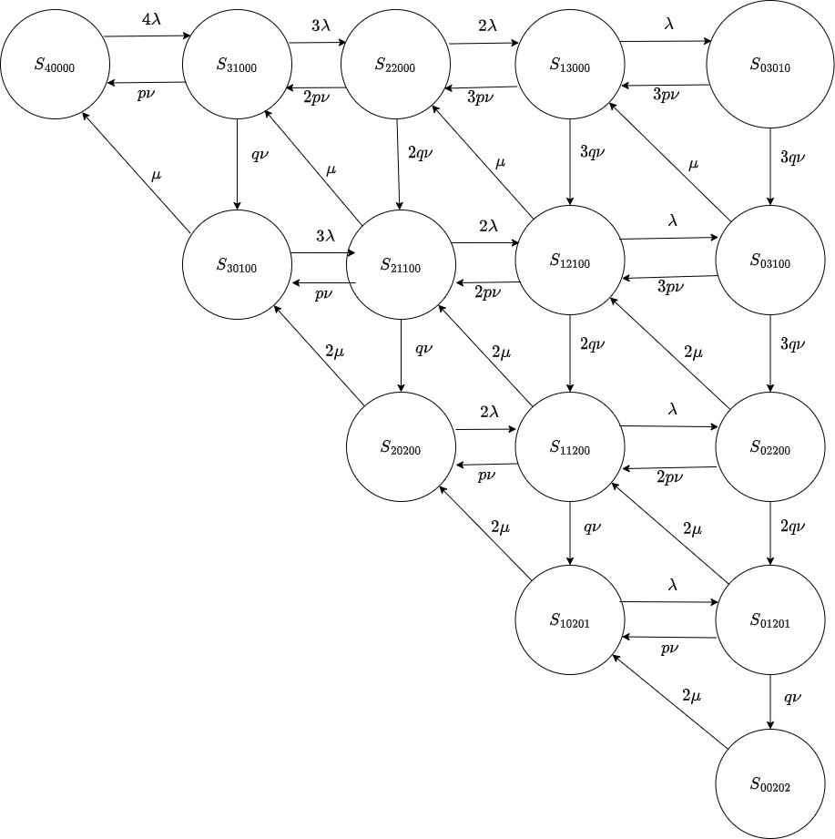
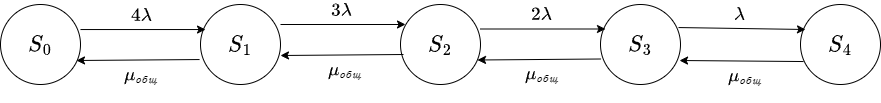
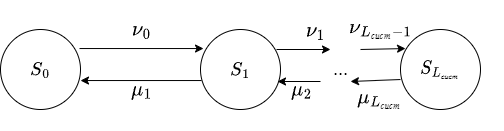

Кузнецов Григорий ИУ5-83Б

# Задание

$K$ программистов могут писать программы для выполнения на одном из $M$ серверов, при этом программа не попадает сразу на сервер, а обрабатывается на одном из $N$ специальных компьютеров, которые проверяют отсутствие вирусов. Интенсивность работы программистов $\lambda$, интенсивность работы компьютеров-антивирусов $\nu$, интенсивность работы основных серверов $\mu$, программа оказывается с вирусом с вероятностью $p$. Если программа с вирусом, она получает отказ обслуживания на основных серверах. Для компьютеров по проверке вирусов имеется ограничение по длине очереди $m_1$, для основных серверов ограничение по длине очереди $m_2$.

- Нарисовать граф состояний системы, учитывая количество программистов, которые пишут программу, количество программ на компьютерах-антивирусах, количество программ на серверах;
- Написать уравнения Колмогорова для вероятностей состояний, финальных вероятностей;
- Тремя способами (экспериментально, методом укрупнения состояний, по уравнениям Колмогорова) найти основные характеристики эффективности СМО: среднее время пребывания заявки в системе, абсолютную пропускную способность, среднее число заявок в системе.

# Теоритическое решение

```{r}
Variant<-12
set.seed(Variant) 
K<-sample(c(3:6),1)
M<-sample(c(1:3),1)
N<-sample(c(1:3),1)
lambda<-runif(1)
mu<-runif(1)
nu<-runif(1)
p<-runif(1)
m1<-sample(c(1:2),1)
m2<-sample(c(1:2),1)
data.frame(K,M,N,lambda,mu,nu,p,m1,m2)
```


Обозначим $q=1-p$:
Система описывается следующим состоянием: $S_{ijknm}, i = 0..K, j = 0..N, k = 0..M, n = 0..m_1, m = 0..m_2, i+j+k+n+m = K$, где 

- i - количество программистов, подготавливающих программу;
- j - количество работающих компьютеров-антивирусов;
- k - количество серверов, обрабатывающих программу;
- n - количество программ в очереди на проверку на вирусы;
- m - количество программ в очереди на обработку.



Составим уравнения Калмогорова:
$$
\frac{dP_{40000}(t)}{dt} = -4\lambda P_{40000}(t) + p\nu P_{31000}(t) + \mu P_{30100}(t)\\
\frac{dP_{31000}(t)}{dt} = -(3\lambda+\nu) P_{31000}(t) + 4\lambda P_{40000}(t) + 2p\nu P_{22000}(t) + \mu P_{21100}(t)\\
\frac{dP_{22000}(t)}{dt} = -(2\lambda + 2\nu) P_{22000}(t) + 3\lambda P_{31000}(t) + 3p\nu P_{13000}(t) + \mu P_{12100}(t)\\
\frac{dP_{13000}(t)}{dt} = -(\lambda + 3\nu) P_{13000}(t) + 2\lambda P_{22000}(t) + 3p\nu P_{03010}(t) + \mu P_{03100}(t)\\
\frac{dP_{03010}}{dt} = -3\nu P_{03010}(t) + \lambda P_{13000}(t)\\
\frac{dP_{30100}(t)}{dt} = -(3\lambda +\mu) P_{30100}(t) + 2p\nu P_{21100}(t) + 2\mu P_{20200}(t) + q\nu P_{31000}(t)\\
\frac{dP_{21100}(t)}{dt} = -(2\lambda +\mu+\nu) P_{21100}(t) + 2p\nu P_{12100}(t) + 2\mu P_{11200}(t) + 2q\nu P_{22000}(t) + 3\lambda P_{30100}(t)\\
\frac{dP_{12100}(t)}{dt} = -(\lambda +\mu+2\nu) P_{12100}(t) + 3p\nu P_{03100}(t) + 2\mu P_{02200}(t) + 3q\nu P_{13000}(t) + 2\lambda P_{21100}(t)\\
\frac{dP_{03100}(t)}{dt} = -(\mu + 3\nu) P_{03100}(t) +\lambda P_{12100}(t)+3q\nu P_{03010}(t)\\
\frac{dP_{20200}}{dt} = -(2\mu+2\lambda)P_{20200}(t) + q\nu P_{21100}(t) + p\nu P_{11200}(t) + 2\mu P_{10201}(t)\\
\frac{P_{11200}}{dt} = -(2\mu+\lambda+\nu)P_{11200}(t) + 2\lambda P_{20200}(t) + 2p\nu P_{02200}(t) + 2q\nu P_{12100}(t) + 2\mu P_{01201}(t)\\
\frac{P_{02200}}{dt} = -(2\mu+2\nu)P_{02200}(t) + \lambda P_{11200}(t) + 3q\nu P_{03100}(t)\\
\frac{P_{10201}}{dt} = -(2\mu+\lambda)P_{10201}(t) + q\nu P_{11200}(t) + p\nu P_{01201}(t)\\
\frac{P_{01201}}{dt} = -(2\mu+\nu)P_{01201}(t) + 2q\nu P_{02200}(t) + \lambda P_{10201}(t)\\
\frac{P_{00202}}{dt} = -2\mu P_{00202}(t) + q\nu P_{01201}(t)\\
$$

Найдем значения $P$ при $t\to\infty$:
```{maxima}
lambda:0.1693481$mu:0.03389562$nu:0.178785$p:0.6416654$q:1-p$
float(solve([-4*lambda*P40000 + p * nu * P31000 + mu * P30100=0,
        -(3*lambda + nu) * P31000 + 4 * lambda * P40000 + 2 * p * nu * P22000 + mu * P21100=0,
        -(2*lambda+2*nu)*P22000+3*lambda*P31000+3*p*nu*P13000+mu*P12100=0,
        -(lambda+3*nu)*P13000+2*lambda*P22000+3*p*nu*P03010+mu*P03100=0,
        -3*nu*P03010+lambda*P13000=0,
        -(3*lambda+mu)*P30100+2*p*nu*P21100+2*mu*P20200+q*nu*P31000=0,
        P40000+P31000+P22000+P13000+P03010+P30100+P21100+P12100+P03100+P20200+P11200+P02200+
    P10201+P01201+P00202=1,
        -(lambda+mu+2*nu)*P12100+3*p*nu*P03100+2*mu*P02200+3*q*nu*P13000+2*lambda*P21100=0,
        -(mu+3*nu)*P03100+lambda*P12100+3*q*nu*P03010=0,
        -(2*mu+2*lambda)*P20200+q*nu*P21100+p*nu*P11200+2*mu*P10201=0,
        -(2*mu+lambda+nu)*P11200+2*lambda*P20200+2*p*nu*P02200+2*q*nu*P12100+2*mu*P01201=0,
        -(2*mu+2*nu)*P02200+lambda*P11200+3*q*nu*P03100=0,
        -(2*mu+lambda)*P10201+q*nu*P11200+p*nu*P01201=0,
        -(2*mu+nu)*P01201+2*q*nu*P02200+lambda*P10201=0,
        -2*mu*P00202+q*nu*P01201=0],
[P40000,P31000,P22000,P13000,P03010,P30100,P21100,P12100,P03100,P20200,P11200,P02200,
    P10201,P01201,P00202]));
```

$$
\left[ \left[ P_{40000}=0.006976048890890992 , P_{31000}=
 0.02322777043483836 , P_{22000}=0.03202395876064511 , P_{13000}=
 0.02007302768881386 , P_{3010}=0.006337834270861684 , P_{30100}=
 0.06079927808382139 , P_{21100}=0.11448099181979 , P_{12100}=
 0.1058579707300933 , P_{3100}=0.03357285862563104 , P_{20200}=
 0.07663113206380487 , P_{11200}=0.1538219711551632 , P_{2200}=
 0.07641029811813202 , P_{10201}=0.09099856532190678 , P_{1201}=
 0.1022031276738121 , P_{202}=0.09658516636179533 \right]  \right] 
$$
```{r}
S <- data.frame(P40000=0.006976048890890992,P31000=0.02322777043483836,P22000=0.03202395876064511,P13000=0.02007302768881386,P03010=0.006337834270861684,P30100=0.06079927808382139,P21100=0.11448099181979,P12100=0.1058579707300933,P03100=0.03357285862563104,P20200=0.07663113206380487,P11200=0.1538219711551632,P02200=0.07641029811813202,P10201=0.09099856532190678,P01201=0.1022031276738121,P00202=0.09658516636179533)
S
```

- Среднее число заявок в системе:
$$
L_{сист} = 0\cdot P_{40000}+1\cdot(P_{31000}+P_{30100})+2\cdot(P_{22000}+P_{21100}+P_{20200})+
3\cdot(P_{13000}+P_{12100}+P_{11200}+P_{10201})+4\cdot(P_{03010}+P_{03100}+P_{02200}+P_{01201}+P_{00202})
$$

```{r}
L_syst <- S$P31000 + S$P30100 + 2 * (S$P22000 + S$P21100 + S$P20200) + 3 * (S$P13000 + S$P12100 + S$P11200 + S$P10201) + 4 * (S$P03010 + S$P03100 + S$P02200 + S$P01201 + S$P00202)
L_syst
```
Среднее число занятых каналов:
$$
L_{зан} = 1\cdot(P_{30100} + P_{21100}+P_{12100}+P_{03100}) + 2\cdot(P_{20200}+P_{11200}+P_{02200}+P_{10201}+P_{01201}+P_{00202}) 
$$
```{r}
L_busy <- S$P30100 + S$P21100 + S$P12100 + S$P03100 + 2 * (S$P20200 + S$P11200 + S$P02200 + S$P10201 + S$P01201 + S$P00202)
L_busy
```

- Абсолютная пропускная способность:
$$
\lambda'=L_{зан}\cdot\mu=0.05111499
$$

```{r}
A <- L_busy * mu
A
```

Средняя интенсивность суммарного входного потока:
$$
\Lambda = (K - L_{сист})\cdot\lambda = 0.1857764
$$
```{r}
A_inp <- (K - L_syst) * lambda
A_inp
```
- Срденее время пребывания заявки в системе:
$$
T_{сист} = \frac{L_{сист}}{\Lambda} = 15.62626
$$
```{r}
T_syst <- L_syst / A_inp
T_syst
```

# Метод укрепления состояний

Предложим декомпозицию нашей задачи в виде двух моделей.
В первой модели совокупность серверов и компьютеров по проверке наличия вирусов заменим только одним обобщенный параметром - интенсивностью обслуживания $\mu_{общ}$. Тогда модель будет обычной моделью рождения гибели для замкнутой системы:



$$
P_0 = \left(1+\frac{4\lambda}{\mu_{общ}} + \frac{4\cdot3\lambda^2}{\mu_{общ}^2}+...+\frac{4!\lambda^4}{\mu_{общ}^4}\right)^{-1}\\
P_1 = P_0\frac{4\lambda}{\mu_{общ}}\\
P_2 = P_0\frac{4\cdot3\cdot\lambda^2}{\mu_{общ}^2}\\
...\\
L_{сист}=\sum_{k=1}^4 k\cdot P_k\\
T_{сист} = \frac{L_{сист}}{\lambda(4-L_{сист})}
$$

Во второй модели будем считать, что в системе постоянно циркулируют $L_{сист}$ заявок. В качестве состояний системы возьмем количество заявок, обрабатываемых на основных серверах:


$$
\nu_n = (1-p)\nu\cdot \text{min}(N,L_{сист}-n),\quad n=0,...,L_{сист}-1\\
\mu_n = \mu\cdot\text{min}(M,n),\quad n=1,2,..,L_{сист}\\
\pi_0=\left(1+\frac{\nu_0}{\mu_1}+\frac{\nu_0\nu_1}{\mu_1\mu_2}+...\right)^{-1}\\
\pi_1 = \pi_0\cdot\frac{\nu_0}{\mu_1}\\
\pi_2= \pi_0\cdot\frac{\nu_0\nu_1}{\mu_1\mu_2}\\
...\\
\mu_{общ}=\sum_{n=1}^{L_{сист}}\pi_n\cdot\mu_n
$$

```{r}
results <- data.frame(L_syst = numeric(2), A_new = numeric(2), T_syst = numeric(2))
results[1, ] <- c(L_syst, A_inp, T_syst)
colnames(results) <- c("Среднее число заявок в системе", "Абсолютная пропускная способность", "Срденее время пребывания заявки в системе")
rownames(results) <- c("уравнения Колмогорова", "метод укрупнения состояний")

L_syst <- 1
getNu <- function(n) {
  return((1-p)*nu*min(N, L_syst - n))
}
getMu <- function(n) {
  return(mu * min(M, n))
}
getTop <- function(n) {
  top <- 1
  for (i in 1:n) {
    top <- top * getNu(i - 1)
  }
  return(top)
}
getBottom <- function(n) {
  bottom <- 1
  for (i in 1:n) {
    bottom <- bottom * getMu(i)
  }
  return(bottom)
}

for (indx in 1:10-0) {
  
  pi_0 <- 1
  for (i in 1:L_syst) {
    pi_0 <- pi_0 + getTop(i) / getBottom(i)
  }
  pi_0 <- 1 / pi_0
  pi <- c()
  for (i in 1:L_syst) {
    pi <- c(pi, pi_0 * getTop(i) / getBottom(i))
  }
  
  mu_o <- 0
  for (i in 1:L_syst) {
    mu_o <- mu_o + pi[i] * getMu(i)
  }
  
  P_0 <- 1
  for (i in 1:K) {
    P_0 <- P_0 +  factorial(K) / factorial(K - i) * lambda^i / mu_o^i
  }
  P_0 <- 1 / P_0
  P <- c()
  for (i in 1:K) {
    P <- c(P, P_0 * factorial(K) / factorial(K - i) * lambda^i / mu_o^i)
  }
  L_syst <- 0
  for (i in 1:K) {
    L_syst <- L_syst + i * P[i]
  }
}

T_syst <- L_syst / (lambda * (K - L_syst))

results[2, ] <- c(L_syst, mu_o, T_syst)
results
```

# Экспериментальный расчет
```{r}

library(methods)

setClass("state", slots = list(antivirusBusy = "numeric", serversBusy = "numeric", programmersWriting = "numeric", antivirusQueue = "numeric", serverQueue = "numeric"))

setClass("event", slots = list(type = "character", time = "numeric", meta = "ANY"))
getEventTime <- function(events) {
  ret <- c()
  for (i in events) {
    ret <- c(ret, i@time)
  }
  return(ret)
}

events <- c()
currentTime <- 0
Iterations <- 10000

state <- new("state", antivirusBusy = 0, serversBusy = 0, programmersWriting = K, antivirusQueue = 0, serverQueue = 0)

createEvent <- function(events, type, time) {
  return(c(events, new("event", type = type, time = currentTime + time, meta = NULL)))
}

P <- new.env(hash = TRUE, parent = emptyenv(), size = NA)
calculateP <- function(state) {
  key <- paste(state@programmersWriting, state@antivirusBusy, state@serversBusy, state@antivirusQueue, state@serverQueue, sep = ",")
  if (is.null(P[[key]])) P[[key]] <- 1
  else P[[key]] <- P[[key]] + 1
}
calculateP(state)

for (i in 1:K) {
  events <- createEvent(events, "programCreated", rexp(1, lambda))
}

amount <- 0

for (i in 1:Iterations) {
  
  events <- events[order(getEventTime(events))]
  event <- events[[1]]
  events <- events[-1]
  currentTime <- event@time
  
  if (event@type == "programCreated") {
    state@programmersWriting <- state@programmersWriting - 1
    if (state@antivirusBusy < N) {
      state@antivirusBusy <- state@antivirusBusy + 1
      events <- createEvent(events, "antivirusDone", rexp(1, nu))
    }
    else if (state@antivirusQueue < m1) {
      state@antivirusQueue <- state@antivirusQueue + 1
    }
    else {
      amount <- amount + 1
      state@programmersWriting <- state@programmersWriting + 1
      events <- createEvent(events, "programCreated", rexp(1, lambda))
    }
  }
  else if (event@type == "antivirusDone") {
    state@antivirusBusy <- state@antivirusBusy - 1
    if (runif(1) <= p) {
      amount <- amount + 1
      events <- createEvent(events, "programCreated", rexp(1, lambda))
      state@programmersWriting <- state@programmersWriting + 1
    }
    else if (state@serversBusy < M) {
      state@serversBusy <- state@serversBusy + 1
      events <- createEvent(events, "serverDone", rexp(1, mu))
    }
    else if (state@serverQueue < m2) {
      state@serverQueue <- state@serverQueue + 1
    }
    else {
      amount <- amount + 1
      events <- createEvent(events, "programCreated", rexp(1, lambda))
      state@programmersWriting <- state@programmersWriting + 1
    }
    
    if (state@antivirusQueue > 0) {
      state@antivirusQueue <- state@antivirusQueue - 1
      state@antivirusBusy <- state@antivirusBusy + 1
      events <- createEvent(events, "antivirusDone", rexp(1, nu))
    }
  }
  else if (event@type == "serverDone") {
    amount <- amount + 1
    state@serversBusy <- state@serversBusy - 1
    events <- createEvent(events, "programCreated", rexp(1, lambda))
    state@programmersWriting <- state@programmersWriting + 1
    
    if (state@serverQueue > 0) {
      state@serverQueue <- state@serverQueue - 1
      state@serversBusy <- state@serversBusy + 1
      events <- createEvent(events, "serverDone", rexp(1, mu))
    }
  }
  
  calculateP(state)
}

F <- new.env(hash = TRUE, parent = emptyenv(), size = NA)
for (i in ls(P)) {
  F[[gsub(",","",i)]] <- P[[i]] / (Iterations + 1)
}

L_syst_n <- F[["31000"]] + F[["30100"]] + 2 * (F[["22000"]] + F[["21100"]] + F[["20200"]]) + 3 * (F[["13000"]] + F[["12100"]] + F[["11200"]] + F[["10201"]]) + 4 * (F[["03010"]] + F[["03100"]] + F[["02200"]] + F[["01201"]] + F[["00202"]])
a_new_n <- amount / currentTime
                                                                                                                                                                           
results <- rbind(results, "эксперимент" = c(L_syst_n, a_new_n, L_syst_n / a_new_n))
results

```

