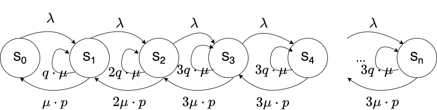

# РК 1
Кузнецов Григорий ИУ5-83Б

Вариант 2

# Задача 1

Два стрелка независимо друг от друга стреляют по мишени. Первый попадает в мишень с вероятностью 0.4 и имеет три патрона в запасе, второй с вероятностью 0.6 и имеет два патрона в запасе.Каждый стрелок стреляет или до первого попадания в мишень, или до израсходования всех патронов. Пусть $X$
 - число патронов, израсходованных первым стрелком, $Y$
 - число патронов, израсходованных вторым. Найти закон распределения $Z = X + Y, M(Z), D(Z)$
 (с использованием производящих функций).
 
## Решение

$X, Y$ являются дискретными случайными величинами, зададим их вероятности:

$$
P\{X=1\} = 0.4\\
P\{X=2\} = 0.6 * 0.4 = 0.24\\
P\{X=3\} = 0.6 * 0.6 * 0.4 + 0.6^3= 0.144 + 0.216 = 0.36\\
P\{Y=1\} = 0.6\\
P\{Y = 2\} = 0.4 * 0.6 + 0.4^2 = 0.24 + 0.16 = 0.4
$$

Производящая функция:
$$
P_\zeta(z) = \sum_{n=0}^\infty p_nz^n\\
P_X(z) = 0.4z + 0.24z^2 + 0.36z^3\\
P_Y(z) = 0.6z + 0.4z^2\\
P_{X+Y}(z) = P_X(z) \cdot P_Y(z) = 0.144\,z^5+0.312\,z^4+0.304\,z^3+0.24\,z^2 \\
M(Z) = P_{X+Y}'(z)|_{z=1} = 5 \cdot 0.144 + 4 \cdot 0.312 + 3 \cdot 0.304 + 2 \cdot 0.24 = 3.36\\
D(Z) = P''_{X+Y}|_{z=1} + M(Z) - (M(Z)^2) = (2.88\,z^3+3.744\,z^2+1.824\,z+0.48)_{z=1} + 3.36 - 3.36^2 = 
0.9984
$$

Получаем закон распределения случайной величины $Z=X+Y$:
$$
Z = \left(\begin{matrix}
2 & 3 & 4 &5 \\
0.24 & 0.304 & 0.312 & 0.144
\end{matrix}\right)
$$

# Задача 2

Имеется простейшая трехканальная СМО с неограниченной очередью. Интенсивность потока заявок 4 заявки/ч; среднее время обслуживания 0,5ч. Выгодно ли, имея в виду: 1) среднюю длину очереди, 2) среднее время пребывания заявки в очереди, 3) среднее время пребывания заявки в СМО, объединить все три канала в один, с втрое меньшим средним временем обслуживания?

## Решение
$$
\lambda = 4 \\
\mu = 1/0.5 = 2\\
y = 2\\
P_0 = \left(\sum_{i=0}^3\frac{y^i}{i!} + \frac{y^4}{3!(3-y)}\right)^{-1} = 
\left(1 + \frac{2}{1} + \frac{4}{2} + \frac{8}{6} + \frac{16}{6}\right)^{-1} = \frac{1}{9}
$$

Средняя длина очереди:
$$
L_{оч} = \frac{y^{n+1}}{n!\cdot n}P_0\cdot \frac{1}{(1-y/n)^2}= \frac{2^{4}}{18}\frac{1}{9}\cdot \frac{1}{(1-2/3)^2} = \frac{8}{9}
$$

Среднее время пребывания заявки в очереди:
$$
W_{оч} = \frac{L_{оч}}{\lambda} = \frac{2}{9} ч
$$

Среднее время пребывания заявки в СМО:
$$
W_{сист} = \frac{L_{оч}+y}{\lambda} = \frac{13}{18} ч
$$

Для однокональной СМО: 
$$
\lambda = 4\\
\mu = 6\\
y = \frac{2}{3}\\
$$

Средняя длина очереди:
$$
L_{оч} = \frac{y^2}{(1-y)} = \frac{4}{3}
$$

Среднее время пребывания заявки в очереди:
$$
W_{оч} = \frac{L_{оч}}{\lambda} = \frac{1}{3} ч
$$
Среднее время пребывания заявки в СМО:
$$
T_{сист} = \frac{L_{сист}}{\lambda} = \frac{y}{(1-y)\lambda} = \frac{1}{2} ч
$$

Сравнивая получаем:

1) Средняя длина очереди в случае многоканальной СМО получается меньше - замена невыгодна

2) Среднее время пребывания заявки в очереди в случае многоканальной СМО получается меньше - замена невыгодна

3) Среднее время пребывания заявки в СМО в случае одноканальной СМО получается меньше - замена выгодна

# Задача 3

Имеется 3-канальная СМО с неограниченной очередью. На ее вход поступает простейший поток заявок с интенсивностью $\lambda=0.7$; время обслуживания — показательное с параметром $\mu=0.8$
. Обслуживание происходит без гарантии качества; с вероятностью $р = 0.6$
 оно удовлетворяет заявку, а с вероятностью $q = 1 - p$
 — не удовлетворяет, и заявка обращается в СМО вторично и либо сразу обслуживается, если нет очереди, либо становится в очередь, если она есть. Ввести состояния СМО (нумеруя их по числу заявок в СМО); найти финальные вероятности состояний и характеристики эффективности СМО. Найти характеристики эффективности СМО: $L_{сист}, \lambda', T_{сист}, W_{оч}, L_{оч}$.
 
## Решение

- Состояние $S_0$ - нет заявок, нет очереди
- Состояние $S_1$ - один канал занят
- Состояние $S_2$ - два канала заняты
- Состояние $S_3$ - три канала заняты
- Состояние $S_4$ - три канала заняты, одна заявка в очереди
- Состояние $S_n$ - три канала заняты, $n - 3$ заявок в очереди

Параметры системы:
$$
n = 3\\
\mu_p = \mu \cdot p = 0.8\cdot 0.6 = 0.4\\
\lambda = 0.7\\
y = \frac{\lambda}{\mu_p} = \frac{4}{7}\\
$$

Вероятности состояний системы:
$$
P_0 = \left(\sum_{i=0}^3\frac{y^i}{i!} + \frac{y^4}{3!(3-y)}\right)^{-1} = \frac{119}{211}\\
P_i = \frac{y^i}{i!}\cdot P_0, i \leq3\\
P_i = \frac{y^i}{3^{i-3}\cdot 3!}\cdot P_0
$$

Характеристики эффективности СМО:
$$
L_{оч} = \frac{y^{n+1}}{n!\cdot n}P_0\cdot \frac{1}{(1-y/n)^2}= \frac{128}{25109}\\
L_{сист} = L_{оч} + y = \frac{2068}{3587}\\
W_{оч} = \frac{L_{оч}}{\lambda} =\frac{1280}{175763} \\
T_{сист} = \frac{L_{сист}}{\lambda} = \frac{20680}{25109}\\
\lambda' = \lambda

$$